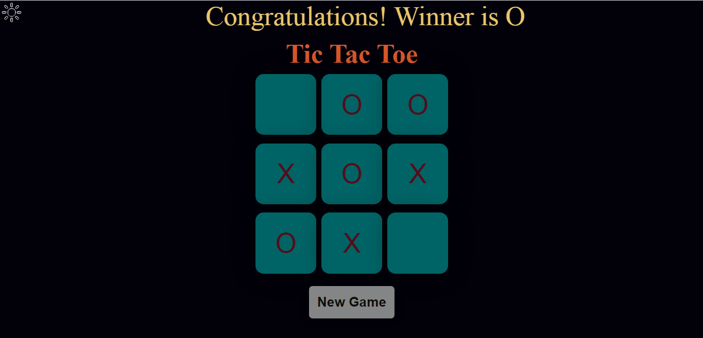
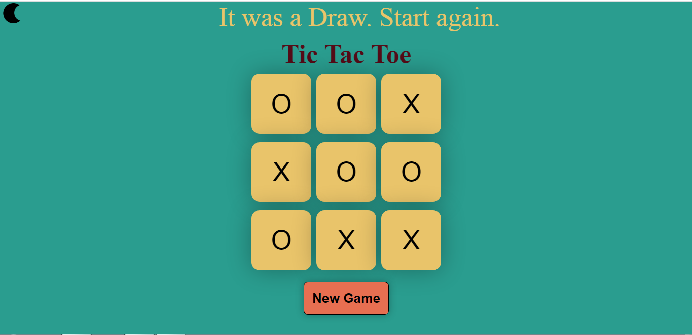

# Tic-Tac-Toe

Welcome to my Tic-Tac-Toe game project! 🎮

## Overview
This is a simple frontend project of the classic Tic-Tac-Toe game. It comes with a few additional features, including the ability to switch between dark and light modes. The layout is designed to be responsive, adapting to different screen sizes using viewport units (vw, vh, vmin).

## Features
- Classic Tic-Tac-Toe gameplay
- Dark and light mode toggle
- Responsive design for various devices

## Technologies Used
- HTML
- CSS
- JavaScript

## Project Structure
- **index.html:** The main HTML file for the game.
- **style.css:** The stylesheet containing the design and layout.
- **script.js:** JavaScript file handling game logic and mode toggling.
- **images:** Folder containing necessary images for the game.

## How to Play
- Clone the repository to your local machine.
- Open `index.html` in your web browser.
- Enjoy playing Tic-Tac-Toe!

### Link

- To clone the repository:

   ```bash
   https://github.com/Rucha-Ambaliya/Tic-Tac-Toe_game.git

- Feel free to fork this project and make your own improvements! If you have any questions or suggestions, don't hesitate to reach out.

## Screenshots
<div style="display: flex; justify-content: space-between;">
  
  
</div>

### Feedback

- If you have any feedback, suggestions, or questions, please feel free to reach out. I appreciate your interest in this project!

## Happy gaming! 🚀
